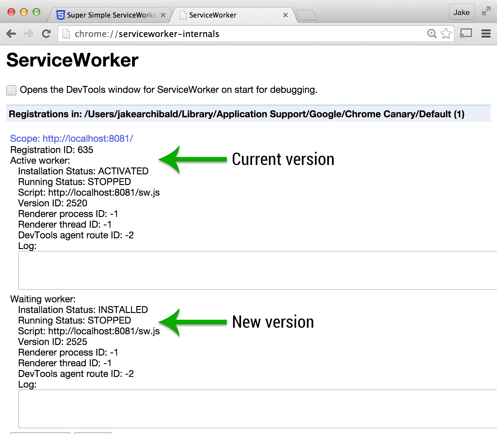

# What is this?

It's a really simple ServiceWorker example. No build systems, (almost) no dependencies. It's designed to be an interactive introduction to the kinds of things you can do with ServiceWorker.

## 1. Get it running locally

Either clone it via git, or just [grab the zip file](https://github.com/jakearchibald/simple-serviceworker-tutorial/archive/gh-pages.zip).

If you already run a web server locally, put the files there. Or you can run a web server from the terminal for the current directory by installing [node.js](http://nodejs.org/) and running:

```sh
npm install
npm start
```

Visit the site in Chrome (`http://localhost:8080` if you used the script above). Open the dev tools and look at the console. Once you refresh the page, it'll be under the ServiceWorker's control.

**You can reset the SW & caches at any point** by navigating to `reset/`. That will unregister the ServiceWorker & clear all the caches.

## 2. Go offline

Disable your internet connection & shut down your local web server.

If you refresh the page, it still works, even through you're offline! Well, we're missing that final JavaScript-added paragraph, but we'll fix that shortly.

Take a look at the code in `index.html` and `sw.js`, hopefully the comments make it easy to follow.

## 3. Fixing that script

The `install` event in the ServiceWorker is setting up the cache, but it's missing a reference to the script that adds the paragraph to the page. Add it to the array. The URL is `script.js`. It doesn't need to be a no-cors request like the Flickr image because it's on the same origin.

Make sure you're online, refresh the page & watch the console. The browser checks for updates to the ServiceWorker script, if anything in the file has changed it considers it to be a new version. The new version is been picked up, but it isn't ready to use.

If you open a new tab and go to `chrome://serviceworker-internals` you'll see both the old & new worker listed.



**Not seeing the new worker?** It could be that your server sent the original worker with a far-future `max-age` or similar caching header. Instead, use the node server mentioned in exercise 1 instead.

Follow the instructions in the page's console to get the new version working.

Test your page offline, the final JavaScript-added paragraph should have reappeared.

## 4. Faster updates!

The update process you just encountered means only one version of your app can run at once. That's often useful, but we don't need it right now.

`self.skipWaiting` called within a ServiceWorker means it won't wait for tabs to stop using the old version before it takes over.

In your `install` event, before the call to `event.waitUntil` add:

```js
if (self.skipWaiting) { self.skipWaiting(); }
```

If you refresh the page now, the new version should activate immediately.

Chrome 40 shipped with ServiceWorker but without `skipWaiting`, so the `if` statement prevents errors there. If you want to see the effects of `skipWaiting`, use a newer version of Chrome, such as [Chrome Canary](https://www.google.com/chrome/browser/canary.html).

`skipWaiting` means your new worker will handle requests from pages that were loaded with the old worker. If that's a problem, or if multiple tabs running different versions of your app/site is a problem, avoid `skipWaiting`.

## 5. Messing around with particular requests

Currently we're responding to all requests by trying the cache & falling back to the network. Let's do something different for particular URLs.

In the `fetch` event, before calling `event.respondWith`, add the following code:

```js
if (/\.jpg$/.test(event.request.url)) {
  event.respondWith(fetch('trollface.svg'));
  return;
}
```

Here we're intercepting URLs that end `.jpg` and responding with a network fetch for a different resource.

Refresh the page, watch the console, and once the new ServiceWorker is active, refresh again. Now you get a different image!

## 6. Manual responses

In the previous step, we handled all requests ending `.jpg`, but often you want finer control over which URLs you handle.

In the `fetch` event, add the following code before the code you added in the previous exercise:

```js
var pageURL = new URL('./', location);

if (event.request.url === pageURL.href) {
  event.respondWith(new Response("Hello world!"))
  return;
}
```

Refresh the page, watch the console, and once the new ServiceWorker is active, refresh again. Different response! This is how you create responses manually.

# Further reading

You're now cooking with ServiceWorkers! To learn more about how they work, and practical patterns you'll use in apps and sites, check out the resources listed on [is-serviceworker-ready](https://jakearchibald.github.io/isserviceworkerready/resources.html).
